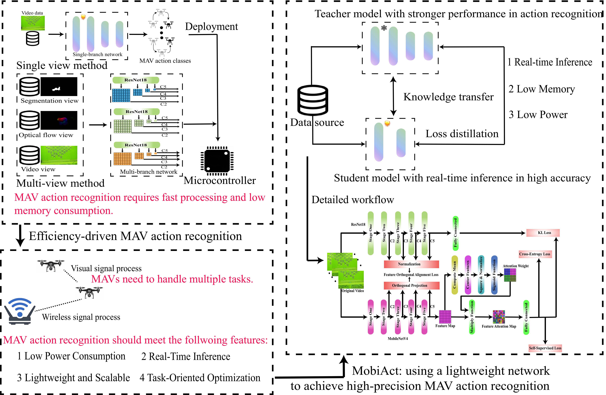
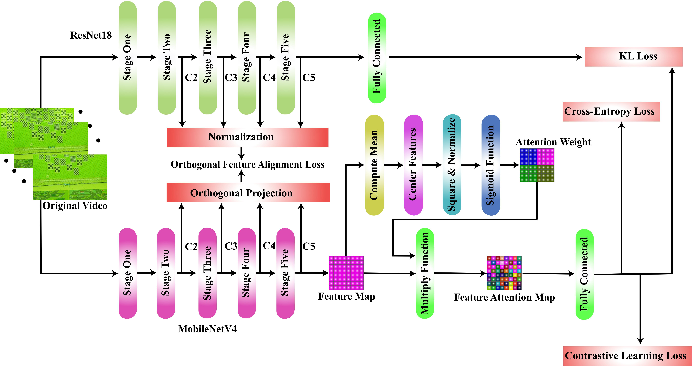

# MobiAct: Efficient MAV Action Recognition Using MobileNetV4 with Contrastive Learning and Knowledge Distillation

## Authors： Nengbo Zhang  and Ho Hann Woei


## Abstract:

In recent years, the task of Micro Aerial Vehicle
(MAV) action recognition has attracted significant research in-
terest. Such capability allows MAVs to infer the intentions of
neighboring agents through motion cues, thereby realizing bio-
inspired communication behaviors reminiscent of bees. However,
existing studies still face significant challenges in achieving
lightweight and fast MAV action recognition, primarily due to
limitations in speed and performance. To address these chal-
lenges, this paper proposes a lightweight MAV action recognition
framework, MobiAct, designed to balance recognition accuracy
and inference speed for efficient motion understanding. Specifi-
cally, the proposed model adopts MobileNetV4 as the backbone
network and introduces a Stage-wise Orthogonal Knowledge
Distillation (SOKD) module to effectively transfer MAV motion
features from a teacher network (ResNet18) to a student network,
thereby enhancing knowledge transfer efficiency. Furthermore,
a parameter-free attention mechanism is integrated into the
architecture to improve recognition accuracy without increasing
model complexity. In addition, a hybrid loss training strategy is
developed to combine multiple loss objectives, ensuring stable and
robust optimization during training. Experimental results demon-
strate that the proposed MobiAct model achieves low-energy
and low-computation MAV action recognition, while maintaining
the fastest action decoding speed among compared methods.
On the MAV-Short action dataset, MobiAct achieves an average
recognition accuracy of 94.8%, confirming its effectiveness in
achieving efficient and accurate MAV action recognition.


## Four Action:

### vShape action:


### up_down action:


### left_right action:


### inv_vShape action:


## Research Motivation:



 


## Method:



## Datasets link:
The part of validate datasets are in following: https://drive.google.com/file/d/1DfgWLfLJ0zHUOGUXlXQdDfDa8Ml0Z2aZ/view?usp=sharing
We will release full data after the paper accept.


# Citation
If you use the dataset and codes in an academic context, please cite our work:
````
Nengbo Zhang, Hann Woei Ho*, MobiAct: Efficient MAV Action Recognition Using MobileNetV4 with Contrastive Learning and Knowledge Distillation.
(The academic paper was submitted to IEEE Transactions on artificial intelligence)
````
