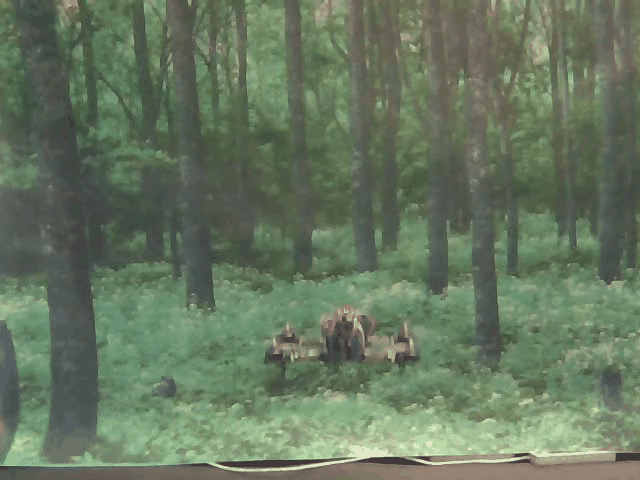
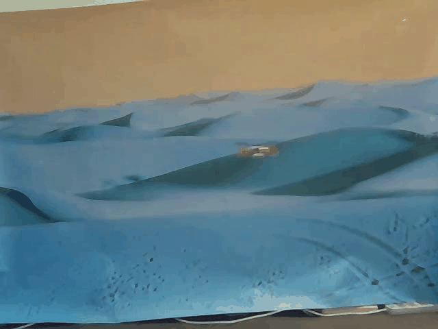
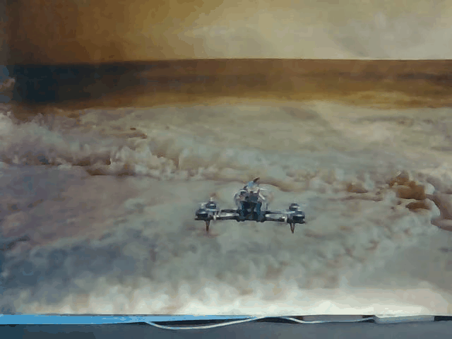
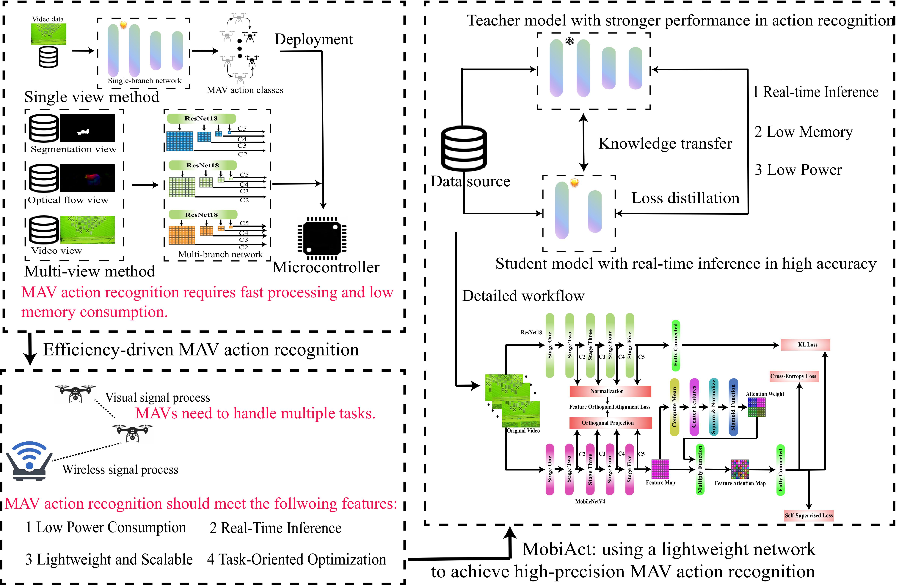
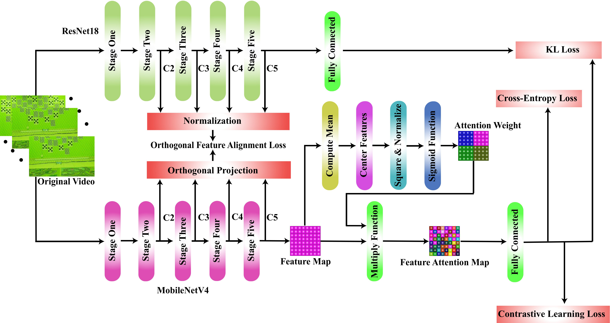

# MobiAct: Efficient MAV Action Recognition Using MobileNetV4 with Contrastive Learning and Knowledge Distillation

## Authors： Nengbo Zhang  and Hann Woei Ho


## Abstract:

Accurate and efficient recognition of Micro Air Vehicle (MAV) motion is essential for enabling real-time perception and coordination in autonomous aerial swarm. However, most existing approaches rely on large, computationally intensive models that are unsuitable for resource-limited MAV platforms, which results in a trade-off between recognition accuracy and inference speed. To address these challenges, this paper proposes a lightweight MAV action recognition framework, MobiAct, designed to achieve high accuracy with low computational cost. Specifically, MobiAct adopts MobileNetV4 as the backbone network and introduces a Stage-wise Orthogonal Knowledge Distillation (SOKD) strategy to effectively transfer MAV motion features from a teacher network (ResNet18) to a student network, thereby enhancing knowledge transfer efficiency. Furthermore, a parameter-free attention mechanism is integrated into the architecture to improve recognition accuracy without increasing model complexity. In addition, a hybrid loss training strategy is developed to combine multiple loss objectives, which ensures stable and robust optimization during training. Experimental results demonstrate that the proposed MobiAct achieves low-energy and low-computation MAV action recognition, while maintaining the fastest action decoding speed among compared methods. Across all three self-collected datasets, MobiAct achieves an average recognition accuracy of 92.12%, while consuming only 136.16 pJ of energy and processing recognition at a rate of 8.84 actions per second. Notably, MobiAct decodes actions up to 2 times faster than the leading method, with highly comparable recognition accuracy, highlighting its superior efficiency in MAV action recognition.


## Four Action:

### vShape action:


### up_down action:


### left_right action:


### inv_vShape action:


<table style="border-collapse: collapse; border: none;">
  <tr>
    <td align="center" style="border: none;">
      <h4>vShape action</h4>
      
    </td>
    <td align="center" style="border: none;">
      <h4>inv_vShape action</h4>
      
    </td>
  </tr>
  <tr>
    <td align="center" style="border: none;">
      <h4>left_right action</h4>
      
    </td>
    <td align="center" style="border: none;">
      <h4>up_down action</h4>
      
    </td>
  </tr>
</table>


## Research Motivation:



 


## Method:



## Datasets link:
The validation datasets can be found here: [https://drive.google.com/file/d/1DfgWLfLJ0zHUOGUXlXQdDfDa8Ml0Z2aZ/view?usp=sharing](https://drive.google.com/drive/folders/1e08KEkLOOQNIBrNbhgSYz0AbkeuAkI1P?usp=drive_link)
We will release the full data after the paper is accepted for publication.


## new environment dataset：
[[通过网盘分享的文件：zhang_data.zip
链接: https://pan.baidu.com/s/1gwtNG0WkGbgQjC8pclYoGw 提取码: 29vr 
--来自百度网盘超级会员v5的分享](https://drive.google.com/drive/folders/1e08KEkLOOQNIBrNbhgSYz0AbkeuAkI1P?usp=sharing)
](https://drive.google.com/drive/folders/1e08KEkLOOQNIBrNbhgSYz0AbkeuAkI1P?usp=drive_link)


## outdoor data link
https://drive.google.com/drive/folders/1n7oB7lQ3cRw2Gs48lFSK_nZdYbGaItBu?usp=drive_link


# Citation
If you use the dataset and codes in an academic context, please cite our work:
````
Nengbo Zhang, Hann Woei Ho*, MobiAct: Efficient MAV Action Recognition Using MobileNetV4 with Contrastive Learning and Knowledge Distillation.
(The academic paper was submitted to IEEE Transactions on artificial intelligence)
````
